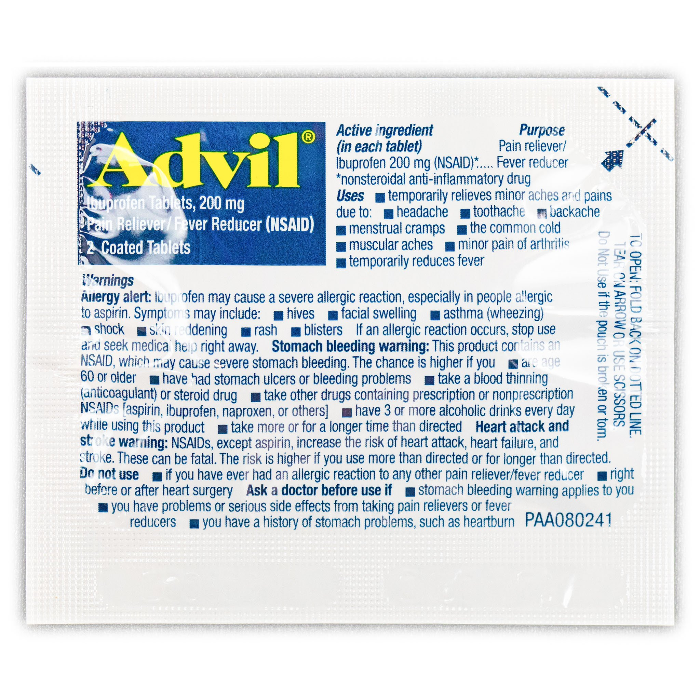

# [IFAK](https://github.com/bitsandbullets/ifak)

## Getting Started

The purpose of this project is to serve as a repository of information for individuals seeking to build an individual first-aid kit (IFAK)

The components listed below fit into a small bag that may be carried on the waist or attached to a pack.

**THIS DOES NOT CONSTITUTE MEDICAL ADVICE. IF YOU ARE IN AN EMERGENCY, CONTACT EMERGENCY SERVICES IMMEDIATELY.**

## Components

| Category | Name | |
| --- | --- | --- |
| Airway | ARS Needle Decompression |  |
| Airway | Hyfin® Vent Chest Seal |  |
| Airway | Pre-Lubricated Naso Airway |  |
| Antihistamine | Benadryl® |  |
| Antihistamine | Hydrocortizone Cream |  |
| Antiseptic | Alcohol Prep Pad |  |
| Antiseptic | Povidone Iodine |  |
| Antiseptic | Triple Antibiotic Ointment |  |
| Burn | Burn Gel w/ Lidocaine |  |
| Digestion | Pepto Bismol® |  |
| Hemorrhage | CAT Tourniquet |  |
| Hemorrhage | Compressed Gauze |  |
| Hemorrhage | Israeli Pressure Bandage |  |
| Hydration | Liquid IV® |  |
| Medication | Advil® |  |
| Medication | Ammonia Towlette |  |
| Medication | Aspirin |  |
| Medication | Tylenol® |  |
| Miscellaneous | Black Sharpie |  |
| Miscellaneous | Duct Tape |  |
| Miscellaneous | Foil Blanket |  |
| Miscellaneous | Medical Shears |  |
| Miscellaneous | Nitrile Gloves |  |
| Miscellaneous | Ziploc Bag |  |
| Sprain/Fracture | SAM® Splint |  |
| Sprain/Fracture | SWAT-T Tourniquet |  |
| Wound Care | Band Aid® |  |
| Wound Care | Hemostat |  |
| Wound Care | Non-stick Pad |  |
| Wound Care | Saline |  |
| Wound Care | Self-adherent Gauze Bandage |  |
| Wound Care | Surgical Glue |  |
| Wound Care | Suture Set |  |
| Wound Care | Tissue Forceps |  |
| Wound Care | Triangular Bandage |  |

## Contributing

If you have a recommendation, please report an [issue](https://docs.github.com/en/github/managing-your-work-on-github/creating-an-issue) or submit a [pull request](https://docs.github.com/en/github/collaborating-with-issues-and-pull-requests/creating-a-pull-request).

## License 

See [License](/LICENSE).
